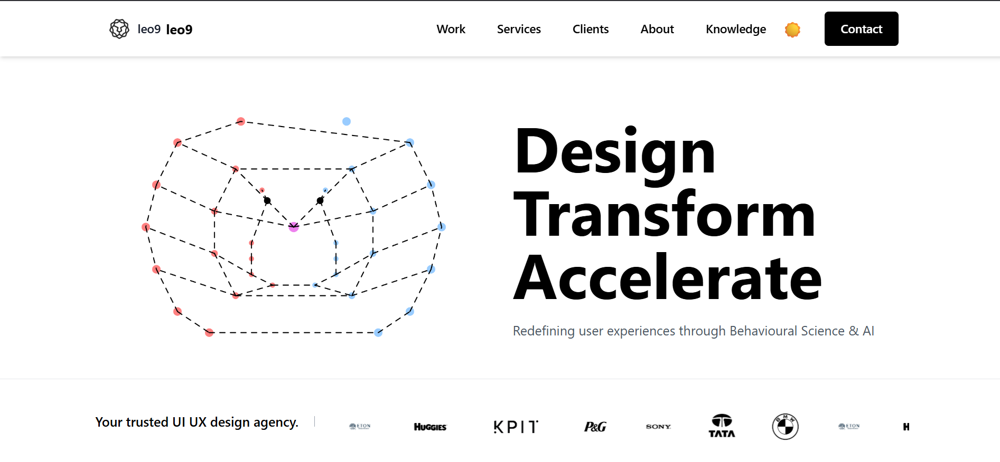
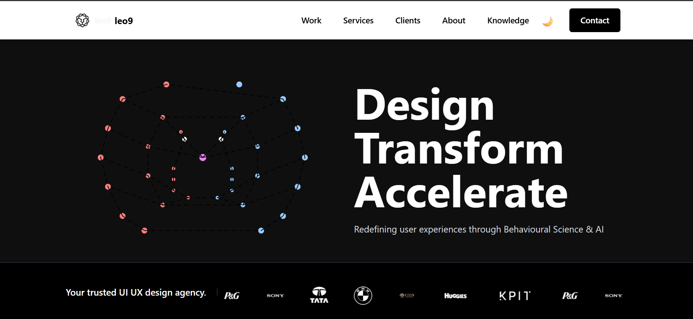
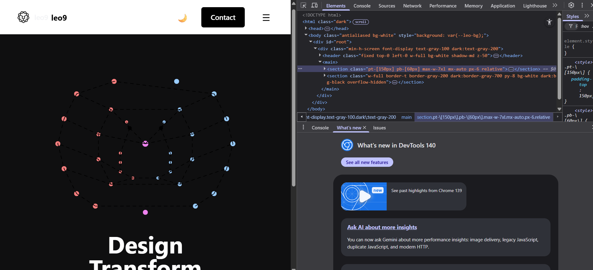

# Leo9 Clone

[Live Demo](https://leo9-clone-1.onrender.com)

A **full-featured clone of the Leo9 Studio website** built with React, Tailwind CSS, and modern frontend technologies. This project replicates the homepage, Hero section, Navbar, and animations for learning and portfolio purposes.

---

## **Table of Contents**

1. [About the Project](#about-the-project)
2. [Features](#features)
3. [Tech Stack](#tech-stack)
4. [Project Structure](#project-structure)
5. [Screenshots / GIFs](#screenshots--gifs)
6. [Installation & Setup](#installation--setup)
7. [Deployment](#deployment)
8. [Usage](#usage)

---

## **About the Project**

This project is a frontend clone of [Leo9 Studio](https://leo9studio.com) created for **learning and portfolio purposes**. It includes:

* Hero section with animations
* Navbar with dark/light mode support
* Responsive layout for desktop, tablet, and mobile
* Particle and graphic animations
* Interactive components with React

---

## **Features**

* Fully **responsive design**
* **Dark mode** toggle (customized)
* **Animated Hero section** with React animations
* **Particles background**
* Interactive **call-to-action buttons**
* **SEO-ready** structure
* Deployment-ready for **Render**

---

## **Tech Stack**

* **Frontend:** React.js, Vite
* **Animations:** Framer Motion / Lottie
* **Deployment:** Render
* **Other Tools:** PostCSS, Autoprefixer

---

## **Project Structure**

```
leo9clone/
├─ public/
│  ├─ index.html
│  └─ assets/
├─ src/
│  ├─ components/
│  │  ├─ Hero.js
│  │  ├─ HeroAnimation.js
│  │  ├─ Navbar.js
│  │  └─ HeroParticles.js
│  ├─ App.js
│  ├─ index.js
│  └─ styles/
├─ package.json
└─ README.md
```

---

## **Screenshots / GIFs**

### **Hero Section Animation**


### **Navbar with Dark/Light Mode**


### **Responsive Layout**





---

## **Installation & Setup**

1. Clone the repo:

```bash
git clone https://github.com/yourusername/leo9clone.git
cd leo9clone
```

2. Install dependencies:

```bash
npm install
```

3. Run the project locally:

```bash
npm start
```

4. Open in browser:

```
http://localhost:3000
```

---

## **Deployment**

This project is deployed on **Render**:

* **Live Demo:** [https://leo9-clone-1.onrender.com](https://leo9-clone-1.onrender.com)

* **Steps for deployment on Render:**

  1. Connect GitHub repo to Render
  2. Set **Build Command**: `npm install && npm run build`
  3. Deploy

* Continuous Deployment: Every push to main branch triggers auto-deploy.

---

## **Usage**

* Click buttons and links on the Hero section to test interactions.
* Toggle **dark/light mode** using the Navbar switch.
* Resize the browser to see the **responsive layout**.
* Use this clone for ** learning purposes only**.
